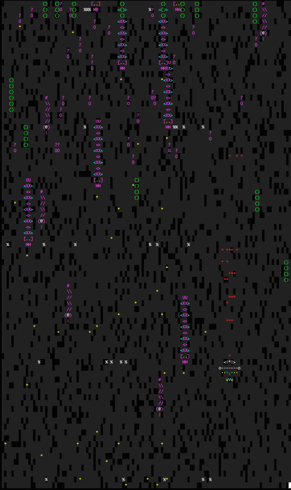

# Piscine C++ rush#00 FT_RETRO, Apr 2015
>>>>> #####Shoot-them-up with n-curses. (group project)

#####Grade ``(TBD/125)`` ``(TBD/125)*``
--------  -----------------------

<br>

Team: [wide-aze](https://github.com/wide-aze) / [ngoguey](https://github.com/Ngoguey42).
 
### Classes tree:
```cpp
class Game //singleton
class Background //singleton
class Scheduler //singleton

class IMovIA
class AMovPatternDefault : public IMovIA
class AMovPatternLombric : public IMovIA
class AMovPatternSheep : public IMovIA

class IShootIA
class AShootPatternDefault : public IShootIA

class AObject
class Shape //one instance per objects below (static)
class Player : public AObject
class Sheep : public AObject, public AMovPatternSheep
class Fizzy : public AObject, public AMovPatternFizzy
class Lombric : public AObject, public AMovPatternLombric
class Centipede : public AObject, public AMovPatternSheep, public AShootPatternDefault
class Pig : public AObject, public AMovPatternSheep, public AShootPatternDefault
class Snake : public AObject, public AMovPatternSheep, public AShootPatternDefault
class Missile : public AObject, public AMovPatternMissile
```


<br><br><br><br><br><br><br><br>
